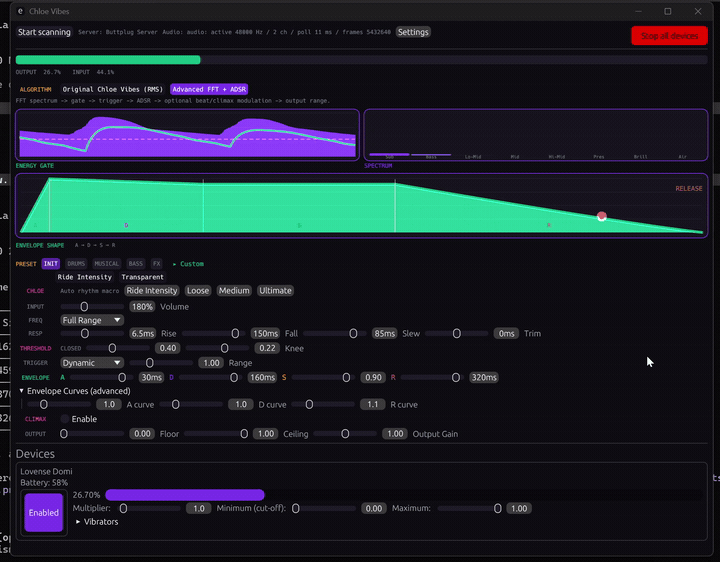

<p align="center">
  
</p>

<p align="center">
  <strong>ChloeVibes</strong><br>
  Audio-Reactive Haptic Control System<br>
  Technical Reference, Software Version 1.1.0
</p>

<p align="center">
  
  
  
  
  
  <a href="LICENSE"></a>
</p>

<p align="center">
  
</p>
<p align="center">
  <em>Desktop console driving a Lovense Domi from live audio in real time (Advanced FFT + ADSR mode). Output level and device intensity track the derived envelope frame by frame.</em>
</p>

---

## General Data

| Item | Value |
|---|---|
| System type | Real-time audio-reactive haptic controller |
| Clients | Windows desktop (Rust, egui) and Android (Kotlin, Jetpack Compose) |
| Signal engine | Single fixed-order DSP chain, ported across both clients and parity-verified in CI |
| Frame rate | 60 Hz nominal (16 ms frame budget) |
| Spectral resolution | 2048-point FFT, 1024 usable bins, 23.4 Hz per bin at 48 kHz |
| Output interface | Lovense BLE over Nordic UART Service; Buttplug 9.0.9 client on desktop |
| Output resolution | Integer intensity 0 to 20 (21 discrete levels) |
| Software version | 1.1.0 |
| License | MIT |

This document describes the operation, specifications, and limitations of the ChloeVibes haptic control system. It assumes familiarity with digital signal processing, Bluetooth Low Energy, and the relevant build toolchains.

---

## 1. General Description

ChloeVibes converts a live audio stream into a haptic drive signal in real time. The system captures system audio, performs spectral analysis, derives an amplitude envelope from spectral content and detected onsets, optionally applies a slow time-domain modulation layer, and transmits the result to a Bluetooth haptic device.

The system is delivered as two clients built on one shared signal engine:

- **Windows desktop.** Rust with `eframe`/`egui`. Captures system audio by WASAPI loopback. Drives devices through a Buttplug 9.0.9 client.
- **Android.** Kotlin with Jetpack Compose (Material3, dark). Captures the system output mix through the Android Visualizer API. Drives Lovense devices over Bluetooth Low Energy directly.

The Android engine is a direct port of the Rust engine (`src/audio.rs`). Output equivalence between the two clients is enforced by a continuous-integration parity test (Section 6). The clients are not permitted to diverge; CI fails on any deviation.

> **WARNING.** This system commands a physical haptic device against a human body. No automatic safety cutoff or panic-stop is implemented in this version. The operator retains full responsibility for output level and for stopping the device. See Section 9.

<p align="center">
  <br>
  <em>Figure 1. Windows desktop console (Advanced FFT + ADSR mode). Top to bottom: transport and audio status, energy gate and 8-band spectrum, ADSR envelope shape, preset and Chloe rhythm controls, signal parameters, and the connected Lovense Domi device panel.</em>
</p>

<p align="center">
  
  &nbsp;&nbsp;&nbsp;&nbsp;
  <br>
  <em>Figure 2. Android client. Signal-chain controls (left) and Climax Engine controls with Wave, Stairs, and Surge patterns (right).</em>
</p>

---

## 2. Theory of Operation: Signal Chain

Each audio frame is processed through a fixed-order chain. The order is invariant on both clients. No stage is reordered and no stage is skipped.

```
   SYSTEM AUDIO
        |
        v
   [ Spectral Analyzer ] ---> 2048-pt FFT, Hann window, 8 perceptual bands, centroid, flux
        |
        v
   [ Noise Gate ] ---------> hysteresis, optional auto-gate (25% open-time target)
        |
        v
   [ Beat Detector ] ------> adaptive flux onset detection, tempo tracking, onset prediction
        |
        v
   [ ADSR Envelope ] ------> attack/decay/sustain/release, velocity overshoot, frequency shaping
        |
        v
   [ Climax Engine ] ------> slow time-domain modulation, edge-and-deny (disabled by default)
        |
        v
   [ Output Map ] ---------> intensity 0 to 20, asymmetric slew
        |
        v
   LOVENSE DEVICE (BLE / Buttplug)
```

### 2.1 Spectral Analyzer

A 2048-point fast Fourier transform with a Hann window (symmetric variant) and 2/N magnitude normalization. The lower 1024 bins are retained, giving 23.4 Hz per bin at a 48 kHz sample rate. The desktop client uses `rustfft`. The Android client uses a hand-written radix-2 Cooley-Tukey transform on the microphone path and the Android Visualizer FFT output on the system-audio path. Both clients apply identical normalization.

The magnitude spectrum is reduced to eight perceptual bands across 20 Hz to 20 kHz. Band edges are identical on both clients: 20, 60, 250, 500, 2000, 4000, 6000, 12000, 20000 Hz. The band labels are Sub, Bass, Lo-Mid, Mid, Hi-Mid, Pres, Brill, Air.

The analyzer computes per-band RMS energy, spectral centroid (DC bin excluded), and half-wave-rectified spectral flux (the sum of positive bin-to-bin magnitude increases). The `rms_power` and `dominant_frequency` fields are reserved and are hardwired to 0.0 in the Rust engine.

### 2.2 Noise Gate

A hysteresis gate with threshold-proportional hysteresis and asymmetric smoothing: instantaneous open, smoothed close. An optional auto-gate maintains a 100-bin energy histogram, recalculated every 86 frames, and selects a threshold that holds the gate open approximately 25% of the time. The auto-gate result is blended with the manual threshold by a configurable amount.

### 2.3 Beat Detector

Onset detection runs on spectral flux against an adaptive threshold computed as the mean plus a multiple of the standard deviation over a 43-frame window. Onsets are subject to a 55 ms refractory cooldown, bounding detection at approximately 270 BPM at sixteenth-note resolution. Tempo is tracked across the most recent 16 onset timestamps. The engine publishes a predicted next-onset time when tempo confidence exceeds 0.5. Downstream, each client pre-fires the drive command approximately 76 ms ahead of the predicted onset when tempo confidence exceeds 0.6, compensating for transmission and actuator latency.

### 2.4 ADSR Envelope Processor

A full Attack-Decay-Sustain-Release envelope with an independent power-curve exponent per stage. Velocity overshoot drives the attack target to a maximum of 1.2 (120%) on hard transients. Frequency-dependent shaping, keyed to spectral centroid, reduces sustain by up to 25% and extends release by up to 40% for low-centroid content. During sustain the processor applies a five-layer modulation on irrational frequency ratios (0.17 to 2.7 Hz, selected so the summed waveform does not repeat) and deterministic stochastic micro-pauses: true-zero intervals of 3 to 6 frames (48 to 96 ms) recurring every 2 to 8 seconds. The minimum retrigger interval is 20 ms.

### 2.5 Climax Engine

Final-stage slow time-domain modulation. Disabled by default. See Section 3.

### 2.6 Output Map

A single parity-locked stage (`map_output` in Rust, `mapOutput` in Kotlin). Below threshold the stage returns zero. Above threshold the shaped envelope is mapped into the device range [min, max], scaled by gain, and clamped. Both clients apply asymmetric output slew: 85 ms nominal, with the rising edge at approximately 30 ms (0.35 of the configured slew). This stage is verified value-for-value by the parity test (Section 6).

---

## 3. Climax Engine

The Climax Engine applies slow time-domain modulation over multi-minute cycles to delay neural adaptation to a sustained drive signal. It is disabled by default in every preset and is engaged only by an experience preset, a one-click profile, or manual control.

### 3.1 Cycle Structure

Cycle length is 8 to 240 seconds, default 90 seconds, identical on both clients. Intensity ramps along one of three patterns:

- **Wave.** Smooth S-curve.
- **Stairs.** Quantized stepped climb.
- **Surge.** Front-loaded power curve.

In the terminal fraction of each cycle the engine either teases (sharp reduction followed by a slow rebuild) or surges to peak on an accelerating curve. Behavior escalates over the first six completed cycles (cycle maturity 0 to 1): tease depth and surge magnitude both increase with maturity.

### 3.2 Anti-Adaptation Layers

Six modulators are summed over the macro cycle to maintain an aperiodic drive signal:

| Layer | Function | Range |
|---|---|---|
| 5-oscillator micro-pulse | Five detuned sinusoids (detune 0.07 and 0.13) summed to a composite pulse | up to 7 Hz, 10 Hz during surge |
| Sub-harmonic flutter | Low-frequency resonance, deepening with maturity | 8% to 24% depth |
| Lorenz-attractor chaos | Deterministic chaotic oscillator (sigma 10, rho 28, beta 8/3); non-repeating | 6% to 18% depth |
| Breathing-rate modulation | Low-rate modulation at approximately 0.18 Hz | 6% to 16% depth |
| Stochastic micro-pauses | True-zero intervals, 48 to 96 ms, every 2 to 8 s (applied in the ADSR stage) | 3 to 6 frames |
| 5-layer sustain modulation | Irrational-ratio modulation (applied in the ADSR stage) | 0.17 to 2.7 Hz |

> **NOTE.** The micro-pauses and the five-layer sustain modulation are implemented in the EnvelopeProcessor (Section 2.4), one stage upstream of the Climax Engine. They are listed here as part of the anti-adaptation behavior.

### 3.3 Arousal Momentum and Edge-and-Deny

Arousal momentum accumulates by 0.12 per completed cycle, hard-capped at 0.75, and feeds peak gain to a maximum of 3.8x at full ramp. Momentum decays only during silence; an active session does not relax until the audio stops.

The edge-and-deny state machine monitors sustained high output and forces a reduction once the high-output dwell exceeds the trigger time. The parameters escalate with cycle maturity:

| Parameter | Early | Mature |
|---|---|---|
| Deny depth (reduction) | 60% | 90% |
| Deny duration | 0.6 s | 2.4 s |
| Trigger time (high-output dwell) | 6 s | 3 s |
| Post-deny overshoot | +0.30 | +0.55 (cap 0.65) |

On a device that reports a second actuator, the engine drives the secondary motor in a dynamic unison-to-anti-phase relationship: in phase at low output, increasingly out of phase as output rises.

### 3.4 Desktop One-Click Profiles

The desktop client provides three preconfigured Climax profiles in addition to the manual parameters:

| Profile | Pattern | Intensity | Build-up | Notes |
|---|---|---|---|---|
| Edge | Wave | 0.62 | 130 s | Extended low-rate cycle |
| Overload | Surge | 0.88 | 75 s | Fast escalation |
| Punisher | Stairs | 1.0 | 55 s | Maximum intensity and modulation depth |

---

## 4. Preset Catalog

A preset is a complete snapshot of every signal parameter. Presets are organized into five categories: INIT, DRUMS, MUSICAL, BASS, FX.

| Client | Factory presets | Climax-enabled |
|---|---|---|
| Windows (desktop) | 29 | 3 (Slow Tease, Ride the Beat, Break Me) |
| Android | 32 | 5 (the above, plus Chloe Medium, Chloe Ultimate) |

Desktop category counts: INIT 2, DRUMS 5, MUSICAL 6, BASS 6, FX 10. The Android catalog contains the same 29 presets plus the three Chloe rhythm-profile presets (Loose, Medium, Ultimate) as BASS-category entries. On the desktop client the same three Chloe profiles are applied through one-click rhythm-profile controls rather than catalog entries; this accounts for the entire difference between the 29-entry and 32-entry catalogs.

Selected presets:

| Preset | Category | Description |
|---|---|---|
| Ride Intensity | INIT | Neutral loudness follower. Default on launch. |
| Hi-Hat Tingle | FX | High-pass, treble-reactive. Present on both clients. |
| Slow Tease | Experience | 120 s edging cycle, Wave pattern. |
| Ride the Beat | Experience | 60 s music-locked escalation, Surge pattern. |
| Break Me | Experience | 45 s build to maximum intensity, deepest pulse, dual-motor anti-phase. |

> **NOTE.** The `threshold_knee` and `dynamic_curve` fields exist in the Android `Preset` structure but not yet in the desktop catalog structure. The Chloe profiles are catalog presets on Android and one-click controls on desktop. Bringing the desktop catalog to full parity is a tracked task.

---

## 5. Output Interface and Device Compatibility

### 5.1 Lovense Protocol

Commands are ASCII strings terminated with a semicolon, transmitted over the Nordic UART Service. Intensity is an integer from 0 to 20 (21 discrete levels), not 0 to 100 or 0 to 255. Single-motor command: `Vibrate:N;`. Dual-motor command: `Vibrate1:X;Vibrate2:Y;`.

### 5.2 Device Support

| Capability | Windows (desktop) | Android |
|---|---|---|
| Transport | Buttplug 9.0.9 client to Intiface (default); embedded server fallback | Direct BLE GATT over Nordic UART Service |
| Device reach | Any device supported by the connected Buttplug or Intiface server | Lovense devices reachable over BLE |
| Single-motor | Supported | Supported |
| Dual-motor | Any multi-actuator scalar device reported by the server, addressed per actuator by index | Lovense Edge and Edge 2 only (see 5.3) |

### 5.3 Android Dual-Motor Limitation

Independent `Vibrate1`/`Vibrate2` control on Android is confirmed only for the Lovense Edge and Edge 2 (DeviceType code `P`, fixture-verified). All other devices, including the Domi 2 (the primary test device for this project), are driven as a single motor by design. Detection matches the device-reported DeviceType code against a single-entry whitelist. An unrecognized code defaults to single-motor operation, because a false dual-motor classification can silence a single-motor device.

> **CAUTION.** Do not assume independent dual-motor control on Android for any device other than the Edge and Edge 2.

### 5.4 Android BLE Connection Sequence

Unfiltered low-latency scan with a 15 s timeout. Connect over TRANSPORT_LE. Request HIGH connection priority. Request a 185-byte MTU. Call `discoverServices()` only from the `onMtuChanged` callback. Issuing service discovery immediately after the MTU request drops discovery on many host stacks (GATT status 19). Verified on Samsung Galaxy S23 Ultra with Lovense Edge 2.

---

## 6. Cross-Platform Parity

The Android engine is a direct port of the Rust engine. Output equivalence is enforced by a golden-dataset parity test.

| Stage | Windows (Rust) | Android (Kotlin) | Status |
|---|---|---|---|
| Spectral / FFT | `rustfft`, 2048-point | radix-2 Cooley-Tukey and Visualizer FFT; identical size, window, normalization | Equivalent |
| Gate | Proportional hysteresis, 25% auto-gate | Ported | Equivalent |
| Beat detector | Adaptive flux onset, tempo, onset prediction | Ported; 76 ms pre-fire at confidence above 0.6 | Equivalent |
| ADSR | Full ADSR, overshoot, frequency shaping, sustain modulation, micro-pauses | Ported | Equivalent |
| Climax engine | 8 to 240 s cycles, 6 layers, edge-and-deny | Ported; same range and patterns | Equivalent |
| Output stage | `map_output`, asymmetric slew | `mapOutput`, configurable slew | Equivalent, parity-tested |
| Audio capture | WASAPI loopback, dedicated thread | Visualizer system audio, microphone fallback | Different transport, same target |
| Preset catalog | 29 presets | 32 presets (3 Chloe, 2 added fields) | Tracked gap |
| Dual-motor | Per-actuator index, general | Edge / Edge 2 only | Not equivalent |
| Device transport | Buttplug / Intiface | Direct Lovense BLE | Different stacks |

`tests/parity.rs` runs the full chain over deterministic synthetic PCM and writes a golden CSV of 6 scenarios by 468 frames (2,808 data rows). The Android `ParityTest.kt` regenerates identical PCM, runs the ported chain, and asserts that every output column matches within tolerance (1e-4 on the Rust side, 1e-3 on the Kotlin side to absorb floating-point operation ordering). The six scenarios cover all three trigger modes (Dynamic, Binary, Hybrid) and all three Climax patterns (Wave, Stairs, Surge), plus the high-sustain clamp region. CI fails on any deviation.

---

## 7. Specifications

| Parameter | Value |
|---|---|
| Signal chain | Spectral, Gate, Beat, ADSR, Climax, Output (fixed order) |
| FFT | 2048-point, Hann window, 1024 usable bins, 23.4 Hz per bin at 48 kHz |
| Perceptual bands | 8 (Sub, Bass, Lo-Mid, Mid, Hi-Mid, Pres, Brill, Air), 20 Hz to 20 kHz |
| Frame rate | 60 Hz nominal (16 ms budget); Android UI refresh 30 Hz |
| Predictive onset lead | 76 ms at tempo confidence above 0.6 |
| Velocity overshoot | up to 120% of attack target |
| Climax cycle | 8 to 240 s (default 90 s) |
| Peak gain (Climax) | up to 3.8x |
| Output resolution | Lovense intensity 0 to 20 integer (21 levels) |
| BLE command rate | Desktop 50 Hz (20 ms, 0.5% dead-band); Android 33 Hz (30 ms minimum interval) |
| Desktop stack | Rust, `eframe`/`egui` 0.33.3, Buttplug 9.0.9, `rustfft`, WASAPI loopback |
| Android stack | Kotlin, Jetpack Compose (Material3), package `com.ashairfoil.chloevibes`, version 1.1.0 (versionCode 2) |
| Android SDK | minSdk 26 (Android 8.0), target/compile SDK 35, Java/Kotlin 17 |
| Test suite | 61 Rust tests (runner count; 36 distinct test functions), clippy `-D warnings`, `fmt --check`, Kotlin unit and parity tests |
| License | MIT |

> **NOTE.** The product version is 1.1.0, as carried by the `VERSION` file and the Android build. The desktop crate `Cargo.toml` version currently reads 0.5.0 and is scheduled to be raised to 1.1.0. This is an internal version discrepancy, not a separate release.

---

## 8. Installation and Operation

### 8.1 Windows Desktop

The desktop client is a Buttplug 9.0.9 client.

1. Start a Buttplug server. By default the client connects to an external server at `ws://127.0.0.1:12345`; [Intiface Central](https://intiface.com/central/) is the standard host. If no server is reachable, the client starts an embedded in-process server with seven communication managers: btleplug BLE, websocket-server, serialport, Lovense Connect, Lovense HID dongle, Lovense serial dongle, and XInput.
2. Build and run:
   ```sh
   cargo run --release
   ```
   To target a specific server:
   ```sh
   cargo run --release -- --server-addr ws://127.0.0.1:12345
   ```
3. Connect and scan, select a preset, and start audio playback. Settings persist between sessions. Closing the application stops all devices.

### 8.2 Android

1. Install the APK from a tagged release, or build:
   ```sh
   cd android && ./gradlew assembleDebug
   ```
2. Grant permissions. The client reads the system output mix through the Android Visualizer API, which requires the `RECORD_AUDIO` permission even though it does not use the microphone. Bluetooth scan and connect permissions are requested as required. If the Visualizer stalls or returns silence, the client falls back to the microphone automatically.
3. Scan, connect, select a preset, and start audio playback.

Minimum platform: Android 8.0 (API 26). Target: API 35.

---

## 9. Limitations

The following are not implemented in this version. Operate accordingly.

- **No automatic safety cutoff.** No panic-stop and no automatic intensity limiter are implemented. The only means of halting output are the manual "Stop all devices" control and, on desktop, automatic stop on application close.
- **No automatic reconnection.** A BLE or RF dropout requires manual reconnection. The session does not re-establish the link on its own.
- **Android dual-motor scope.** Independent dual-motor control is confirmed only for the Lovense Edge and Edge 2 (Section 5.3).
- **Catalog parity gap.** The desktop preset catalog lacks the three Chloe presets and the `threshold_knee` / `dynamic_curve` fields present on Android.
- **Reserved fields.** `rms_power` and `dominant_frequency` are hardwired to 0.0 in the Rust engine.

---

## 10. Build, Test, and Continuous Integration

```sh
# Desktop
cargo build --release
cargo test
cargo test --test parity

# Android
cd android && ./gradlew assembleDebug
cd android && ./gradlew testDebugUnitTest
```

Continuous integration runs on GitHub Actions. The Rust job (windows-latest) runs `cargo fmt --check`, `cargo clippy -- -D warnings`, the release build, the test suite, and the dedicated parity test. The Android job (ubuntu-latest) runs the Kotlin unit and parity tests, builds the debug APK, uploads it as an artifact, and publishes a GitHub Release on `v*` tags. A separate workflow builds a rolling debug APK on every push to `master`.

---

## 11. Modification

The following constraints are load-bearing. Do not modify the system without observing them.

1. The signal-chain order is invariant: Spectral, Gate, Beat, ADSR, Climax, Output. Do not reorder or skip stages on either client.
2. The two engines are a single specification in two implementations. A change to one requires the equivalent change to the other. The parity test (Section 6) enforces this in CI.
3. CI must pass. Rust: `cargo fmt --check`, `cargo clippy -- -D warnings`, `cargo test`, and the parity test. Android: `./gradlew testDebugUnitTest` before the APK build.
4. Platform-specific behavior is documented as platform-specific. The open gaps in Section 9 are tracked, not concealed.

---

## 12. License

MIT. Copyright (c) 2024 coldbricks. See [LICENSE](LICENSE).
