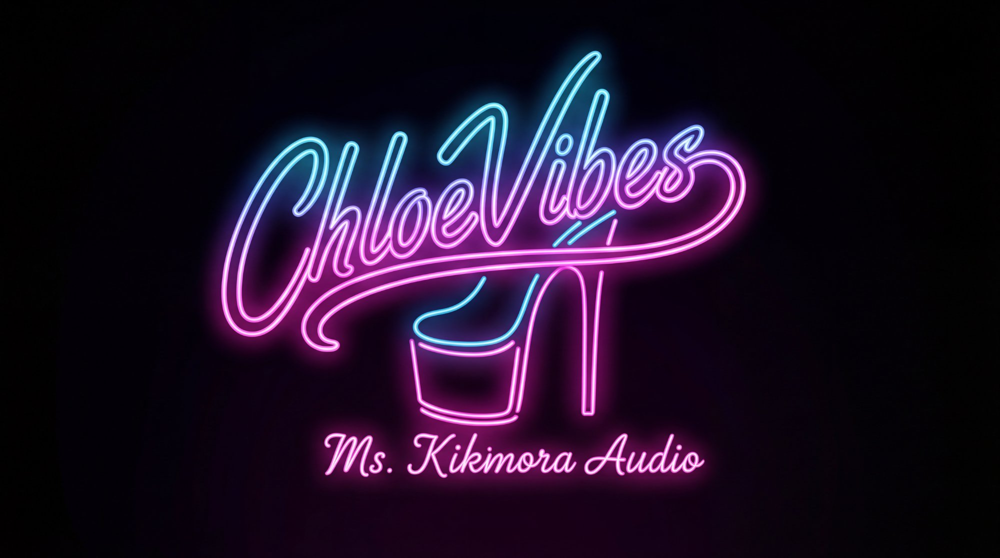
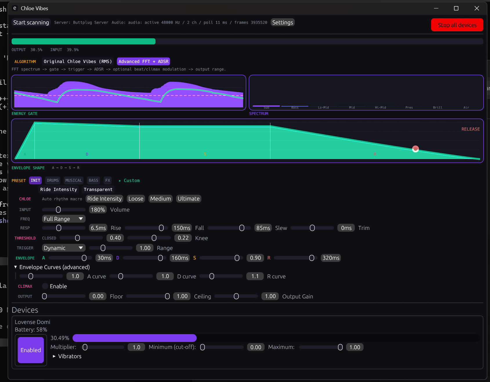
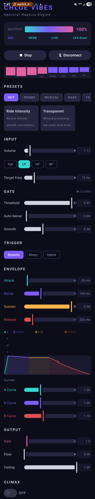
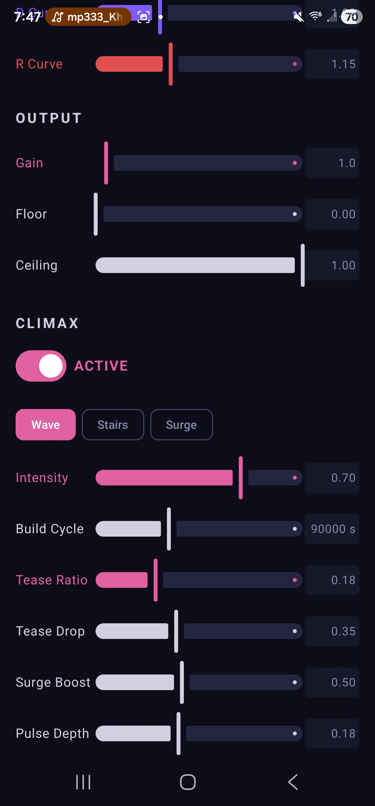

<p align="center">
  
</p>

<p align="center">
  <strong>A synthesizer for your body.</strong><br>
  Audio-reactive haptic engine that turns music into physical sensation.
</p>

<p align="center">
  <a href="#windows-desktop"></a>
  <a href="#android"></a>
  <a href="LICENSE"></a>
</p>

<p align="center">
  <em>FFT spectral analysis &rarr; ADSR envelope shaping &rarr; psychophysiologically-tuned modulation &rarr; Bluetooth haptic output</em>
</p>

---

ChloeVibes captures system audio (on both Windows and Android), analyzes it in real time with FFT spectral processing, and drives Bluetooth haptic devices through every beat, note, and bass drop. It doesn't just follow volume — it understands the music.

The signal chain is built like a synthesizer: spectral frequency analysis feeds a noise gate, trigger system, and full ADSR envelope processor. On top of that, the **Climax Engine** adds a slow-burn modulation layer with tease/deny psychology, chaos oscillators, sub-harmonic resonance, and dual-motor spatial phasing — all designed using psychophysiological principles to prevent neural adaptation and build intensity over time.

**Windows** uses Rust + egui with WASAPI system audio capture and [Buttplug.io](https://buttplug.io) for device control.
**Android** uses Kotlin + Jetpack Compose with the Visualizer API and direct BLE (Lovense protocol via Nordic UART Service).

Both platforms share identical signal processing engines kept in strict sync.

<p align="center">
  <br>
  <em>Windows — real-time spectrum analyzer, ADSR envelope visualization, climax engine controls, and Lovense Domi connected</em>
</p>

<p align="center">
  
  &nbsp;&nbsp;&nbsp;&nbsp;
  <br>
  <em>Android — full signal chain controls (left) and Climax Engine with Wave/Stairs/Surge patterns (right)</em>
</p>

---

## How It Works

```
                                SIGNAL CHAIN
  ┌──────────┐   ┌──────────┐   ┌──────┐   ┌─────────┐   ┌──────────┐   ┌─────────────┐
  │  System   │──▶│ Spectral │──▶│ Noise│──▶│ Trigger │──▶│   ADSR   │──▶│   Climax    │
  │  Audio    │   │ Analyzer │   │ Gate │   │  Mode   │   │ Envelope │   │   Engine    │
  │ (FFT)     │   │ 8 bands  │   │      │   │         │   │          │   │  (optional) │
  └──────────┘   └──────────┘   └──────┘   └─────────┘   └──────────┘   └──────┬──────┘
                                                                                │
                     ┌──────────────────────────────────────────────────────────┘
                     ▼
              ┌─────────────┐    ┌──────────────┐
              │ Output Gain │──▶│  BLE Device  │  Motor 1: primary signal
              │ + Range Map │   │  (Buttplug/  │  Motor 2: phase-offset signal
              └─────────────┘   │   Lovense)   │  (spatial movement on dual-motor devices)
                                └──────────────┘
```

### Stage by Stage

| Stage | What It Does |
|-------|-------------|
| **Spectral Analyzer** | 2048-point FFT with Hann windowing. Splits audio into 8 perceptual bands (Sub through Air). Extracts band energies, RMS power, spectral centroid, spectral flux, and dominant frequency. |
| **Frequency Filter** | Selects which part of the spectrum drives the output: Full Range, Low Pass (bass lock), High Pass (treble sparkle), or Band Pass (vocal isolation). |
| **Noise Gate** | Threshold-based gate with proportional hysteresis and asymmetric smoothing (instant open, smooth close). Optional auto-gate adapts to ambient level. |
| **Trigger Mode** | Converts audio energy to trigger magnitude. **Dynamic** = continuous intensity scaling. **Binary** = fixed on/off pulsing. **Hybrid** = blend of both. |
| **ADSR Envelope** | Full Attack-Decay-Sustain-Release with configurable curve exponents per stage. Velocity overshoot on hard transients. Frequency-dependent shaping (bass = deep pressure, treble = sharp tap). Stochastic micro-pauses during sustain for nerve reset. |
| **Beat Detector** | Adaptive onset detection via spectral flux with tempo tracking. Predictive onset fires commands ~76ms ahead of the beat to compensate for BLE latency. |
| **Climax Engine** | Long-cycle modulation layer — see below. |

---

## The Climax Engine

The Climax Engine is what separates ChloeVibes from a simple volume follower. It's an optional modulation layer that adds time-domain psychology on top of the audio-reactive signal, designed to build, tease, deny, and overwhelm over minutes-long cycles.

<details>
<summary><strong>Tease &amp; Deny Cycle</strong></summary>

Each cycle follows a **build &rarr; tease &rarr; surge** arc:

- **Build phase:** Arousal gain gradually amplifies the audio-reactive signal. Chaos and sub-harmonic modulation layers grow from subtle to dominant.
- **Tease phase:** Near the end of the cycle, intensity drops sharply (fast cliff), holds at a floor while anticipation builds, then rebuilds agonizingly slowly via a curved ramp. Tease depth escalates across cycles — the first one is gentle, later ones are devastating.
- **Surge phase:** In the final 20% of the cycle, an accelerating curve (slow build, explosive finish) drives intensity to peak. Beat onsets during surge hit 2.5x harder than at cycle start.

</details>

<details>
<summary><strong>Edge-and-Deny</strong></summary>

Independent of the tease cycle, the deny system monitors sustained high output and forces sharp intensity drops to prevent plateau adaptation:

- **Escalating depth:** First deny drops to 40% of peak. After 6+ cycles, denies drop to 10%.
- **Escalating duration:** 600ms initially, growing to 3 seconds in mature sessions.
- **Faster trigger:** Time-to-deny shortens from 6 seconds to 3 seconds as cycles accumulate.
- **Asymmetric envelope:** Sharp cliff down, hold at floor, deliberately slow curved return.
- **Post-deny overshoot:** Each return exceeds the pre-deny level, creating the contrast response.

</details>

<details>
<summary><strong>Anti-Adaptation Layers</strong></summary>

The nervous system rapidly adapts to predictable stimulation. ChloeVibes uses multiple overlapping strategies to prevent this:

| Layer | Rate | Depth | Purpose |
|-------|------|-------|---------|
| **5-oscillator micro-pulse** | 2-10 Hz | Up to 55% | Detuned oscillators create rich harmonic content the body can't filter |
| **Sub-harmonic resonance** | 1.5-4 Hz | 8-24% (scales with progression) | Couples with device motor mechanical resonance for deep tissue stimulation |
| **Lorenz chaos** | Aperiodic | 6-18% (scales with progression) | Deterministic but non-repeating modulation prevents pattern prediction |
| **Breathing-rate modulation** | 0.18 Hz | 6-16% (scales with progression) | Couples with involuntary arousal breathing rhythm |
| **Stochastic micro-pauses** | Every 2-8s | 48-96ms at true zero | Nerve endings physically reset, maintaining long-term sensitivity |
| **5-layer sustain modulation** | 0.17-2.7 Hz | Irrational ratios | Combined waveform never exactly repeats |

</details>

<details>
<summary><strong>Arousal Momentum</strong></summary>

Each completed climax cycle increases arousal momentum (+0.12 per cycle, cap 0.75). Momentum persists across cycles and slowly decays during silence. At maximum momentum with full cycle progression, peak arousal gain reaches **3.8x** — compensating for the neural desensitization that occurs during prolonged stimulation.

</details>

<details>
<summary><strong>Dual-Motor Spatial Phasing</strong></summary>

For devices with two independent motors (e.g., Lovense Domi 2), the climax engine generates a phase-offset signal for the second motor:

- At low intensity: motors stay near unison for raw power
- At high intensity: strong anti-phase creates a "traveling wave" sensation as vibration physically moves between the two ends of the device
- Phase rate accelerates from 0.3 Hz to 2.0 Hz as the cycle builds

</details>

---

## Presets

29 factory presets across 5 categories. Each preset is a complete snapshot of all signal processing parameters — like a synth patch. Pick one as a starting point, then tweak.

| Category | Presets |
|----------|---------|
| **INIT** | Ride Intensity, Transparent |
| **DRUMS** | Drum Hit, Kick Follow, Staccato Pulse, Domi Edge, Rhythm Rider |
| **MUSICAL** | Slow Swell, Vocal Ride, Pluck, Domi Immerse, Crescendo |
| **BASS** | Sub Throb, Wobble Bass, Domi Bass Lock, Deep Trance, Bass Destroyer, Domi Annihilate |
| **FX** | Ambient Wash, Heartbeat, Hi-Hat Tingle, Edge & Deny, Slow Burn, Overwhelm, Psy Spiral, Nerve Storm |

**Experience presets** (climax engine pre-configured):

| Preset | Description |
|--------|-------------|
| **Slow Tease** | Long edging cycle — deep denial drops, gentle rebuilds |
| **Ride the Beat** | Music-locked escalation — chaos + sub-harmonics sync to rhythm |
| **Break Me** | No restraint — extreme surge, aggressive deny, maximum chaos |

---

## Getting Started

### Windows Desktop

**Requirements:**
- Windows 10+
- [Rust stable toolchain](https://rustup.rs/)
- [Visual Studio Build Tools](https://visualstudio.microsoft.com/visual-cpp-build-tools/) with the "Desktop development with C++" workload (required for native BLE and audio dependencies)

```bash
# Build
cargo build --release

# Run
./target/release/chloe-vibes.exe
```

The app launches an **embedded Buttplug server** by default — no external software needed. It auto-detects BLE devices via btleplug, plus supports Lovense Connect, Lovense dongles (HID/serial), serial port devices, and XInput controllers.

To use an external [Intiface Central](https://intiface.com/central/) server instead:
```bash
chloe-vibes.exe --server-addr ws://127.0.0.1:12345
```

**Quick start:**
1. Run the app, click "Start scanning"
2. Enable your device when it appears
3. Select a preset, play music, adjust to taste
4. Enable **CLIMAX** for long-session escalation
5. Double-click any slider to reset to default

### Android

**Requirements:** Android 8.0+ (API 26), RECORD_AUDIO permission (for Visualizer API access to system audio output).

```bash
cd android
JAVA_HOME=/usr/lib/jvm/java-21-openjdk-amd64 ./gradlew assembleDebug
adb install -r app/build/outputs/apk/debug/app-debug.apk
```

The Android app connects directly to Lovense devices via BLE (Nordic UART Service) without any intermediary server.

---

## Architecture

```
chloe-vibes/
├── src/                          # Rust/Windows desktop app
│   ├── main.rs                   # Entry point, panic handler
│   ├── audio.rs                  # Signal engine (SpectralAnalyzer, Gate, BeatDetector,
│   │                             #   EnvelopeProcessor, ClimaxEngine)
│   ├── gui.rs                    # egui UI + processing pipeline + Buttplug device tasks
│   ├── presets.rs                # 29 factory presets
│   ├── settings.rs               # Persistent settings with all signal parameters
│   └── util.rs                   # Buttplug server setup, SharedF32, audio utilities
│
├── android/                      # Kotlin/Compose Android app
│   └── app/src/main/kotlin/com/ashairfoil/chloevibes/
│       ├── MainActivity.kt       # Entry point
│       ├── audio/
│       │   ├── SpectralAnalyzer.kt   # FFT + band energies (pure Kotlin radix-2 FFT)
│       │   ├── Gate.kt               # Noise gate with hysteresis
│       │   ├── BeatDetector.kt       # Onset detection + tempo tracking
│       │   ├── EnvelopeProcessor.kt  # ADSR envelope with micro-pauses
│       │   ├── ClimaxEngine.kt       # Time-domain modulation layer
│       │   ├── AudioCaptureManager.kt # Visualizer/mic capture + processing loop
│       │   └── Presets.kt            # Factory presets (synced with Rust)
│       ├── device/
│       │   ├── BleDeviceManager.kt   # BLE scanning + connection
│       │   └── LovenseProtocol.kt    # Lovense command formatting (NUS)
│       └── ui/
│           ├── MainScreen.kt         # Compose UI
│           └── Theme.kt              # Material theme
│
├── assets/                       # Logo and resources
├── Cargo.toml                    # Rust dependencies
└── CLAUDE.md                     # AI pair-programming directives
```

### Design Principles

- **Signal chain order is fixed:** Spectral &rarr; Gate &rarr; Beat &rarr; Envelope &rarr; Climax &rarr; Output. Never reorder or skip stages.
- **Audio processing on dedicated threads at ~60Hz.** UI reads state via atomic/volatile fields. Signal processing never touches the main thread.
- **Kotlin and Rust engines are direct ports of each other.** When one changes, both change.
- **Presets are immutable snapshots.** Every signal parameter is included. Adding a parameter means updating all 29 presets.

---

## Supported Devices

### Windows (via Buttplug.io)
Any device supported by the [Buttplug protocol](https://buttplug.io) — hundreds of devices including Lovense, We-Vibe, Kiiroo, Magic Motion, Satisfyer, and many more. Connection methods:
- Bluetooth LE (btleplug)
- Lovense Connect Service
- Lovense USB Dongle (HID + Serial)
- Serial port devices
- XInput (game controllers)
- Websocket server devices

### Android (direct BLE)
Lovense devices via Nordic UART Service. Tested with Lovense Domi 2 (dual motor). Commands are ASCII with `;` terminator, intensity range 0-20.

---

## Technical Details

<details>
<summary><strong>FFT Configuration</strong></summary>

- **Window size:** 2048 samples
- **Sample rate:** 48kHz (WASAPI default / Visualizer API)
- **Bin resolution:** ~23Hz
- **Window function:** Hann (reduces spectral leakage)
- **Perceptual bands:** Sub (20-60), Bass (60-250), Lo-Mid (250-500), Mid (500-2k), Hi-Mid (2k-4k), Presence (4k-6k), Brilliance (6k-12k), Air (12k-20k)
- **Full-spectrum weighting:** [0.25, 0.25, 0.15, 0.12, 0.08, 0.06, 0.05, 0.04] — emphasizes where musical energy lives

</details>

<details>
<summary><strong>ADSR Envelope</strong></summary>

Each stage has a configurable curve exponent (1.0 = linear, <1.0 = logarithmic, >1.0 = exponential):

- **Attack:** Ramp to peak. For fast attacks (<50ms), skips directly to peak — motor spin-up provides the physical ramp.
- **Decay:** Fall from peak to sustain level.
- **Sustain:** Holds with 5-layer anti-adaptation modulation at irrational frequency ratios + stochastic micro-pauses.
- **Release:** Fade to zero when gate closes.

Velocity overshoot: strong onsets (drum hits) briefly push past 100% (up to 120%) before decaying to sustain. Frequency-dependent shaping adjusts sustain and release based on spectral centroid — bass holds longer, treble releases faster.

</details>

<details>
<summary><strong>Timing &amp; Latency</strong></summary>

- **Processing rate:** ~60Hz (16ms frames)
- **BLE command resolution:** 0.5% dead-band (catches subtle dynamics)
- **Predictive onset:** When tempo confidence > 60%, pre-fires commands ~76ms before predicted beat
- **Asymmetric input smoothing:** Configurable rise/fall times for musical consistency
- **Output slew rate:** Prevents jarring motor jumps
- **Timing trim:** ±500ms delay/advance ring buffer for manual sync adjustment

</details>

---

## Contributing

This project is built with an AI pair-programming workflow. The `CLAUDE.md` file contains detailed architecture invariants, coding standards, and signal processing domain knowledge that keeps the AI assistant aligned with the project's design principles.

Pull requests welcome. If you're modifying the signal engine, remember: **changes must be mirrored to both Rust and Kotlin** to keep the platforms in sync.

---

## License

[MIT](LICENSE)

---

<p align="center">
  <sub>Built with Rust, Kotlin, and an unreasonable amount of psychophysiology research.</sub>
</p>
