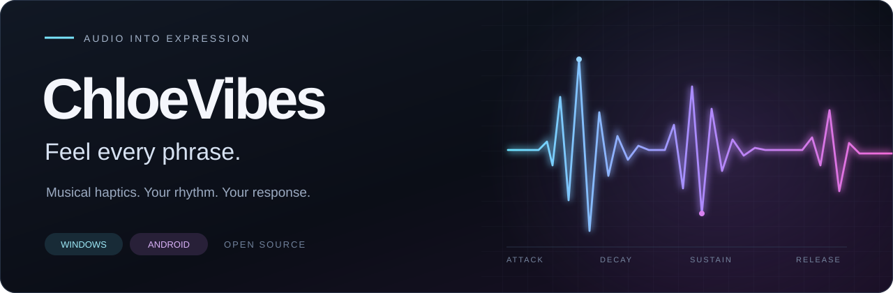
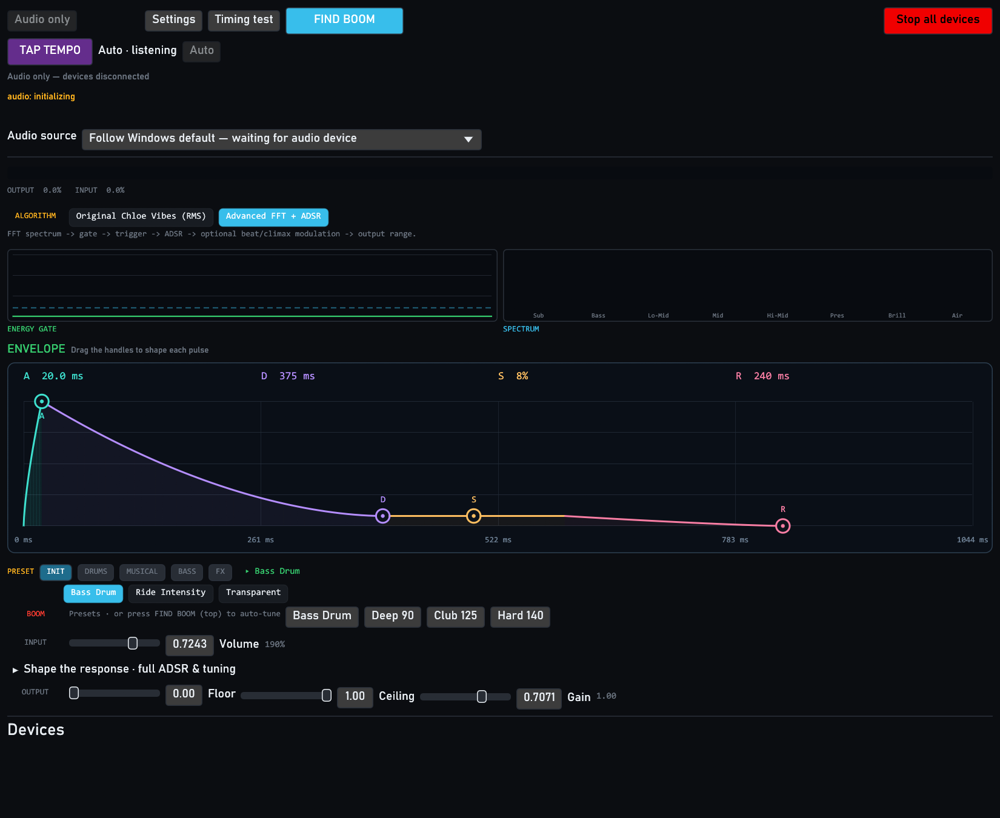
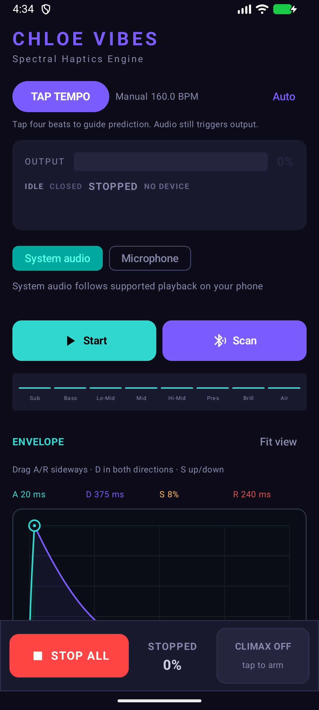

  

  <strong>Turn the music you love into a response you can feel.</strong> 
  Audio-reactive haptics with expressive rhythm, shaped pulses, and room between the beats.

  
  

  <a href="https://github.com/coldbricks/Chloe-Vibes/releases/latest">What's new in v1.6.2</a>
  &nbsp; · &nbsp;
  <a href="docs/TECHNICAL_REFERENCE.md">Guide &amp; technical reference</a>
  &nbsp; · &nbsp;
  <a href="https://github.com/coldbricks/Chloe-Vibes/issues">Feedback</a>

---

### Easy to begin. Yours to shape.

ChloeVibes treats haptics like a musical instrument. A kick can have a distinct attack and a fading tail. A sustained passage can carry texture. Silence can leave space for the next phrase.

Start with one of **33 presets**, or press **FIND BOOM** on Windows to fit a response to the track. Grab the envelope and shape the pulse directly: a sharper attack, a longer tail, a different feel. Open the full controls whenever you want more detail.

  

| **Find the feeling** | **Shape the response** | **Stay with the music** |
| :--- | :--- | :--- |
| Bass Drum, Deep 90, Club 125, and a wider preset collection. Windows FIND BOOM tunes frequency focus and pulse shape. | A large **draggable ADSR editor** on both platforms, plus envelope curves, frequency selection, gate, and output controls. | Predictive beat timing, dynamic response, optional long-cycle modulation, and explicit rests. Added output delay defaults to **zero**. |

### Two native apps. One musical idea.

| | Windows | Android |
| :--- | :--- | :--- |
| **Audio** | Follow Windows default or choose speakers/headphones; reconnect automatically | Choose system audio or microphone |
| **Devices** | Supported vibration and oscillation devices through Buttplug / Intiface | Direct Lovense Bluetooth connection |
| **Tempo** | Tap four beats or use automatic detection | Tap four beats or use automatic detection |
| **Timing test** | Tone, sweep, Wet Floor Bass, Tile Room Throb, How Long You Last | Use a playback app as the audio source |
| **Start simply** | Presets + FIND BOOM | Presets + Simple controls |
| **Shape a pulse** | Drag the envelope; expand full tuning | Touch and drag the envelope; switch to Full controls |

**New in 1.6.2:** top-level **Tap Tempo** on Windows and Android; a Windows timing-test panel with selectable tones, a frequency sweep and three looped grooves; faster wakeup after silence, reinforced stop commands, and capture compatibility controls. [Release details](https://github.com/coldbricks/Chloe-Vibes/releases/tag/v1.6.2).

See the Android touch editor

  

### Your first track

1. Download the app and connect your device.
2. Play music. On Windows, check **Audio source**. Choose **Bass Drum**, or use **FIND BOOM**.
3. Adjust the output to a comfortable level. Explore the full controls whenever you like.

**Windows:** run the executable; [Intiface Central](https://intiface.com/central/) is supported. **Android:** sideload the debug APK and grant the requested audio/Bluetooth permissions. System-audio capture depends on your phone and playback app.

An [optimized Android APK](https://github.com/coldbricks/Chloe-Vibes/releases/latest/download/ChloeVibes-android-release.apk) is also available, with the same features and signing identity. [Build and signing details](docs/TECHNICAL_REFERENCE.md#10-build-test-and-ci).

[Windows audio routing and response timing](docs/WINDOWS_AUDIO.md)

Use **Stop all devices** to end output. Both apps include stale-input handling and stop watchdogs; a disconnected device may not receive a stop command.

---

  <a href="docs/TECHNICAL_REFERENCE.md">Setup, compatibility &amp; build instructions</a>
  &nbsp; · &nbsp;
  <a href="docs/AUTO_LOCK_DESIGN.md">Inside FIND BOOM</a>
  &nbsp; · &nbsp;
  <a href="LICENSE">MIT license</a>

  Built by <a href="https://github.com/coldbricks">coldbricks</a>. 
  Native Rust + Kotlin · Local audio processing · For adult use

